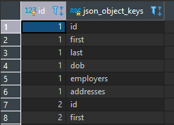

# Parse JSON

### Get key/path value

Get JSON object field by key or JSON array element (indexed from zero, negative integers count from the end)

>    ->

Get JSON object field or array element as TEXT

>    ->>

Get JSON object at the specified path

>    #>

Get JSON object at the specified path as TEXT

>    #>>

Example:

```
select
	prs.id,
	prs.person_data ->> 'first' as "First Name",
	prs.person_data ->> 'last' as "Last Name",
	prs.person_data -> 'employers' -> 0 ->> 'name' as "First Employer"
from person as prs
where cast(prs.person_data -> 'dob' ->> 'year' as numeric) = 1954;
```

Returns JSON value pointed to by path_elems (equivalent to #> operator).

```
(json)  json_extract_path  (from_json json, VARIADIC path_elems text[])
(jsonb) jsonb_extract_path (from_json jsonb, VARIADIC path_elems text[])
```

Returns JSON value pointed to by path_elems as TEXT (equivalent to #>> operator).

```
(text) json_extract_path_text  (from_json json, VARIADIC path_elems text[])
(text) jsonb_extract_path_text (from_json jsonb, VARIADIC path_elems text[])
```

Example:

```
select
	prs.id,
	json_extract_path_text(prs.person_data, 'first') as "First Name",
	json_extract_path_text(prs.person_data, 'last') as "Last Name",
	json_extract_path_text(prs.person_data, 'employers', '0', 'name') as "First Employer"
from person as prs
where cast(json_extract_path_text(prs.person_data, 'dob', 'year') as numeric) = 1954;
```

Result set:


### Get JSON key

Returns set of keys in the outermost JSON object as TEXT column.

```
(setof text) json_object_keys  (json)
(setof text) jsonb_object_keys (jsonb)
```

Example:

```
select prs.id, json_object_keys(prs.person_data)
from person as prs;
```

Result set:



### Get JSON key/value

Expands the outermost JSON object into a set of key/value pairs as a TEXT/JSON columns.

```
(setof key text, value json)  json_each  (json)
(setof key text, value jsonb) jsonb_each (jsonb)
```

Expands the outermost JSON object into a set of key/value pairs as a TEXT/TEXT columns.

```
(setof key text, value text) json_each_text  (json)
(setof key text, value text) jsonb_each_text (jsonb)
```

Example:

```
select prs.id, (json_each(prs.person_data)).*
from person as prs;
```

Using implicit lateral join:

```
select prs.id, KeyValueOfJson.key, KeyValueOfJson.value
from person as prs, json_each(prs.person_data) as KeyValueOfJson;
```

Result set:


### Expand JSON array

Expands a JSON array to a set of JSON values as a column.

```
(setof json)  json_array_elements  (json)
(setof jsonb) jsonb_array_elements (jsonb)
```

Expands a JSON array to a set of TEXT values as a column.

```
(setof text) json_array_elements_text  (json)
(setof text) jsonb_array_elements_text (jsonb)
```

Example:

```
select
	prs.id,
	prs.person_data ->> 'first' as "First Name",
	prs.person_data ->> 'last' as "Last Name",
	json_array_elements(prs.person_data -> 'employers') ->> 'name' as "Employer Name"
from person as prs;
```

Using implicit lateral join:

```
select
	prs.id,
	prs.person_data ->> 'first' as "First Name",
	prs.person_data ->> 'last' as "Last Name",
	employers ->> 'name' as "Employer Name"
from person as prs, json_array_elements(prs.person_data -> 'employers') as employers;
```

Result set:


### Convert JSON object to table

Builds an arbitrary record from a JSON object (see note below). As with all functions returning record, the caller must explicitly define the structure of the record with an AS clause.

```
(record) json_to_record  (json) as type
(record) jsonb_to_record (jsonb) as type
```

Example:

```
select
	prs.id as "Id",
	rec.id as "Person Id",
	rec.first as "First Name",
	rec.last as "Last Name",
	rec.dob ->> 'year' as "Year of Birth"
from person as prs,
json_to_record(prs.person_data) as rec(id text, first text, last text, dob json, dod json, employers json, addresses json);
```

Result set:


### Convert JSON array to table

```
(setof record) json_to_recordset  (json) as type
(setof record) jsonb_to_recordset (jsonb) as type
```

Example:

```
select
	prs.id as "Id",
	rec.id as "Person Id",
	rec.first as "First Name",
	rec.last as "Last Name",
	rec.dob ->> 'year' as "Year of Birth",
	emp.name as "Employer Name",
	emp.position as "Position",
	emp.period ->> 'start' as "Start Year",
	emp.period ->> 'end' as "End Year"
from person as prs,
json_to_record(prs.person_data) as rec(id text, first text, last text, dob json, dod json, employers json, addresses json),
json_to_recordset(rec.employers) as emp(name text, position text, period json);
```

Result set:


### Modify JSON

Returns target with the section designated by path replaced by new_value, or with new_value added if create_missing is true (default is true) and the item designated by path does not exist. As with the path oriented operators, negative integers that appear in path count from the end of JSON arrays.

```
(jsonb) jsonb_set (target jsonb, path text[], new_value jsonb [, create_missing boolean])
```

Example:

```
select
	prs.id,
	jsonb_set(prs.person_data_b, '{employers, 0, name}', '"The Employer"', false)
from person as prs;
```

Returns target with new_value inserted. If target section designated by path is in a JSONB array, new_value will be inserted before target or after if insert_after is true (default is false). If target section designated by path is in JSONB object, new_value will be inserted only if target does not exist. As with the path oriented operators, negative integers that appear in path count from the end of JSON arrays.

```
(jsonb) jsonb_insert (target jsonb, path text[], new_value jsonb [, insert_after boolean])    
```

Example:

```
select
	prs.id,
	jsonb_insert(prs.person_data_b, '{employers, 0}', '{ "name": "Bastil", "position": "Test", "period": { "start": "01/01/2000", "end": "12/31/2010" }}', false)
from person as prs;
```

